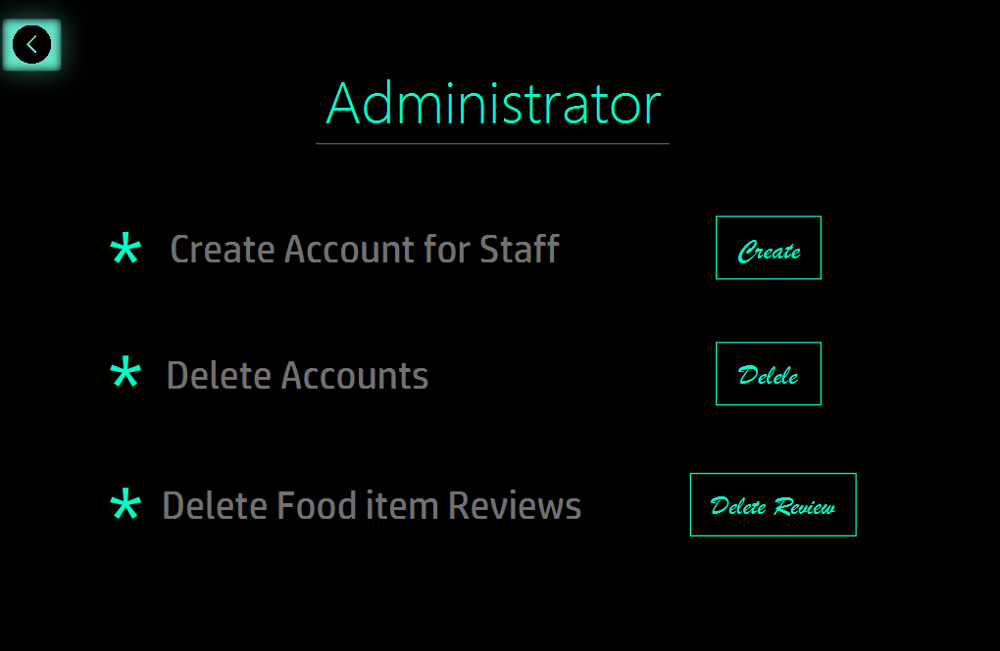
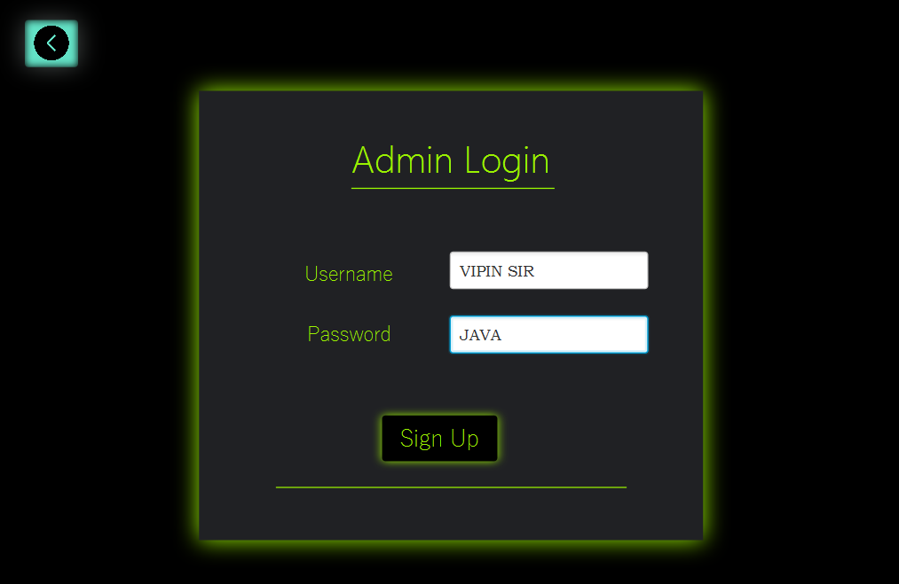
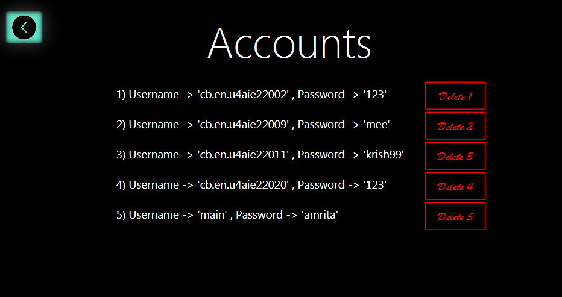
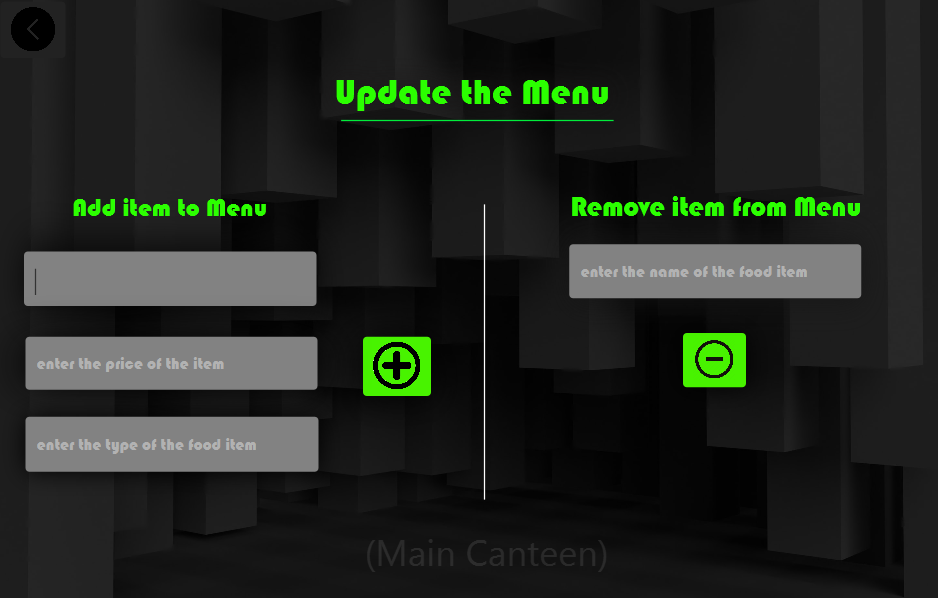
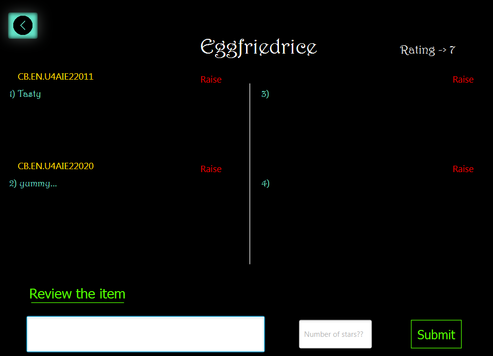
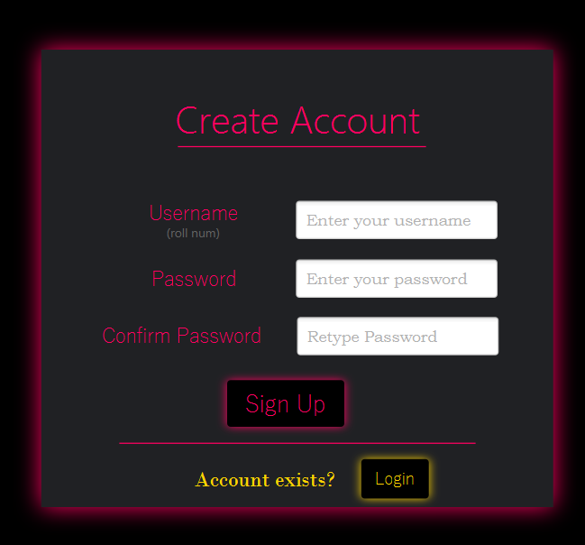
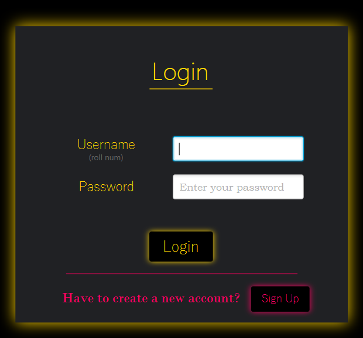
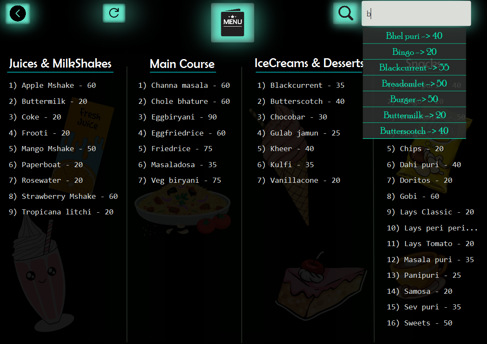

# Canteen Cuisine App

## Overview:
The "Canteen Cuisine App" addresses the challenges faced by students and faculty in the college canteens. It provides real-time updates on available dishes, ensuring users are always aware of the current menu. With reviews and ratings, users can make informed decisions about their food choices, enhancing their overall dining experience.

## Features:
- **Menu Exploration:** Users can browse through the available food items or menu options offered by the canteen.
- **Search Functionality:** The application enables users to search for specific food items or categories to quickly locate their desired meal.
- **User Profiles:** Users may have personalized profiles where they can save favorite items and view order history.
- **Feedback and Ratings:** The application may allow users to provide feedback on the food quality, service, or overall experience, as well as rate different menu items.

## Module-I: Admin
- **Account Management:** Administrator can create and manage staff and student accounts.
- **Access Control:** Administrator can control user access and permissions.
- **Review Management:** Administrator can review and moderate student reviews and ratings, removing or flagging inappropriate content.

## Module-II: Staff
- **Menu Management:** Staff can access and modify the menu.
- **Review and User Information:** Retrieves reviews, ratings, and user account information for staff viewing.
- **Add and Delete Menu Items:** Staff can add new menu items with details and delete menu items by name.
- **Complaint Handling:** Customers can raise complaints about inappropriate reviews or other issues, with stored reviews sent to the Admin for action.

## Module-III: Students/User
- **Food Search:** Students can search for food items by the food item's name.
- **Review and Rating:** Students can write reviews and give ratings for the food items they have tried. They can also view and read reviews submitted by other students.
  
## Tech Stack:
- Scene Builder
- JavaFX
- Java
- SQL

## Screenshots:

## *Home Page*

## *Admin Module*
| Feature                   | Image |
|---------------------------|-------|
| Admin                      |  |
| Admin Login      |  |
| Managing Accounts         |  |

## *Staff Module*
| Feature                   | Image |
|---------------------------|-------|
| Staff Login         |  |
| Menu Updation                      |  |
| Review, Rating modification      |  |

## *Student/User Module*
| Feature                   | Image |
|---------------------------|-------|
| Account Creation                      |  |
| User Login      |  |
| Menu         |  |

## Project Context:
Developed during my second semester for Java coursework.
